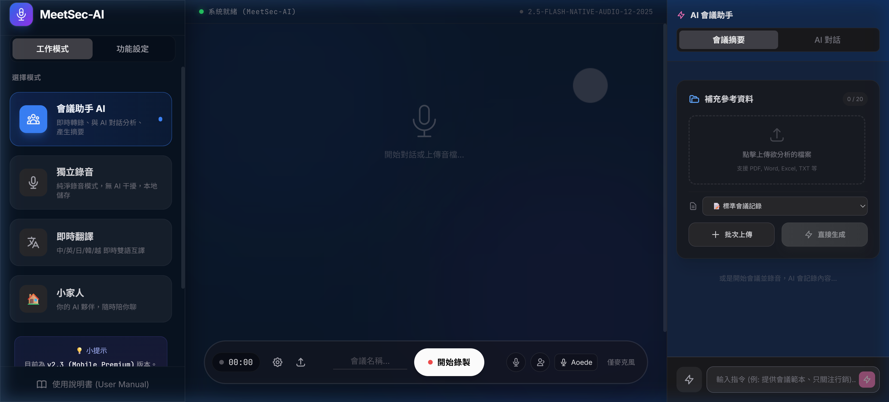
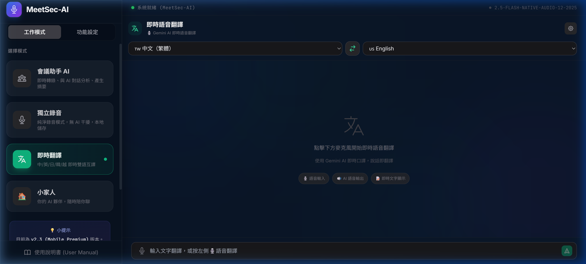
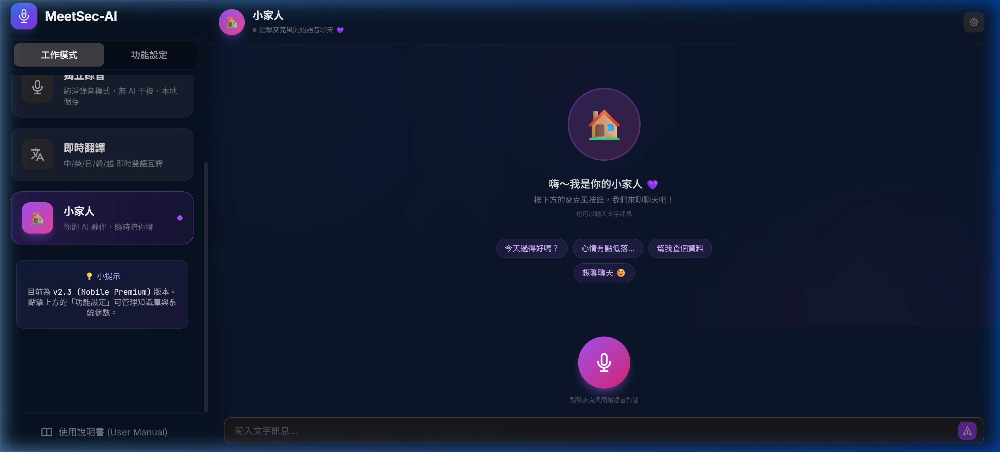
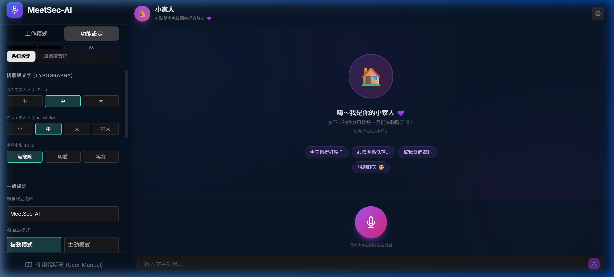

# MeetSec-AI 智慧會議秘書 — 完整操作說明書 v2.3

> **最後更新**：2026 年 4 月  
> **線上版**：[https://meet-sec-ai-mobile.vercel.app/](https://meet-sec-ai-mobile.vercel.app/)  
> **原始碼**：[https://github.com/jerryXpro/MeetSec-AI-Mobile](https://github.com/jerryXpro/MeetSec-AI-Mobile)

---

## 📖 目錄

1. [產品簡介](#1-產品簡介)
2. [快速開始（5 分鐘上手）](#2-快速開始5-分鐘上手)
3. [介面總覽](#3-介面總覽)
4. [模式一：AI 會議助手](#4-模式一ai-會議助手)
5. [模式二：獨立錄音室](#5-模式二獨立錄音室)
6. [模式三：即時語音翻譯](#6-模式三即時語音翻譯)
7. [模式四：小家人 AI 語音聊天](#7-模式四小家人-ai-語音聊天)
8. [AI 會議助手面板（右側）](#8-ai-會議助手面板右側)
9. [知識庫管理](#9-知識庫管理)
10. [系統設定](#10-系統設定)
11. [API Key 申請完整教學](#11-api-key-申請完整教學)
12. [API Key 管理與配額策略](#12-api-key-管理與配額策略)
13. [手機版操作指南](#13-手機版操作指南)
14. [常見問題排除 (FAQ)](#14-常見問題排除-faq)
15. [上傳與使用限制](#15-上傳與使用限制)
16. [行動 APP 開發路線圖](#16-行動-app-開發路線圖)
17. [附錄：版本更新紀錄](#17-附錄版本更新紀錄)

---

## 1. 產品簡介

### 什麼是 MeetSec-AI？

**MeetSec-AI** 是一款專為現代專業人士打造的 **AI 智慧會議秘書**，整合先進的語音辨識、即時翻譯、AI 對話與文件分析技術，在一個介面中提供四大工作模式。

### 四大核心模式

| 模式 | 圖示 | 用途 | 適用場景 |
|------|------|------|----------|
| **AI 會議助手** | 🤖 | 即時語音轉錄 + AI 分析摘要 | 會議記錄、訪談、課堂筆記 |
| **獨立錄音室** | 🎙️ | 純淨錄音，無 AI 干擾 | 訪談錄音、個人備忘、證據保存 |
| **即時語音翻譯** | 🌐 | 中/英/日/韓/越/簡中 六語互譯 | 跨國會議、外語溝通、出差 |
| **小家人 AI** | 🏠 | 即時語音聊天夥伴 | 閒聊、查資料、情感陪伴 |

### v2.3 版本亮點

- 🔊 **即時語音翻譯升級**：翻譯改用 Gemini Live API，延遲從 3-7 秒降至 1-2 秒
- 🎙️ **語音 + 文字雙模式翻譯**：語音翻譯與打字翻譯可同時使用
- 🔊 **雙向語音朗讀**：翻譯結果支援關閉 / 單向 / 雙向三種朗讀模式
- 📝 **會議範本管理**：可自訂、新增、刪除會議摘要範本，支持一鍵重新生成
- 🔍 **小家人連網查詢**：即時資訊（天氣、新聞、股票等）會透過 Google Search 查詢後回答
- 📱 **手機螢幕防關閉**：錄音/語音對話期間自動保持螢幕常亮
- 🛡️ **手機麥克風相容性**：自動偵測可用麥克風，跨裝置無縫切換

---

## 2. 快速開始（5 分鐘上手）

### 步驟 1：開啟應用程式

用瀏覽器前往 **[https://meet-sec-ai-mobile.vercel.app/](https://meet-sec-ai-mobile.vercel.app/)**

> 💡 建議使用 Chrome 或 Edge 瀏覽器，效果最佳。

### 步驟 2：取得 API Key

1. 前往 [Google AI Studio](https://aistudio.google.com/)，登入您的 Google 帳號。
2. 點擊左側邊欄的 **「Get API Key」**。
3. 選擇 **「Create API key」**，建立一組新的 API 金鑰。
4. 複製產生的金鑰（格式類似 `AIzaSy...`）。

### 步驟 3：設定 API Key

1. 點擊左上角的 **☰** 按鈕（或在電腦版由左側選單）。
2. 點擊上方的 **「功能設定」** 分頁。
3. 在「系統設定」中找到 **「Google Gemini API Key」** 欄位。
4. 貼上您的 API Key。
5. 點擊 **「測試錄音連線」** 按鈕確認連線成功。

### 步驟 4：開始使用

回到 **「工作模式」** 分頁，選擇您要使用的模式即可開始！

---

## 3. 介面總覽

### 電腦版佈局

> 下圖為桌面版完整佈局，包含左側選單、中央工作區域與右側 AI 助手面板（會議模式）。



```
┌────────────────────────────────────────────────────┐
│ ┌──────────┐ ┌──────────────────┐ ┌──────────────┐ │
│ │          │ │                  │ │              │ │
│ │  左側    │ │    主要工作      │ │   AI 助手    │ │
│ │  選單    │ │    區域          │ │   面板       │ │
│ │          │ │                  │ │  (會議模式)  │ │
│ │ 模式切換 │ │  語音轉錄/翻譯  │ │  摘要/分析   │ │
│ │ 功能設定 │ │  /聊天/錄音      │ │  對話/匯出   │ │
│ │ 知識庫   │ │                  │ │              │ │
│ └──────────┘ └──────────────────┘ └──────────────┘ │
└────────────────────────────────────────────────────┘
```

### 手機版佈局

- **左上角 ☰**：開啟側邊選單（從底部滑出，全螢幕面板）
- **主要區域**：佔滿全螢幕
- **右側 AI 面板**：在會議模式中，由右上角按鈕展開

### 左側選單結構

選單分為兩個主要分頁：

| 分頁 | 功能 |
|------|------|
| **工作模式** | 切換四大模式（會議/錄音/翻譯/小家人） |
| **功能設定** | 系統設定 + 知識庫管理 |

---

## 4. 模式一：AI 會議助手

> **適用場景**：會議記錄、課堂筆記、訪談紀錄

> 下圖為 AI 會議助手模式的完整畫面。左側選擇「會議助手 AI」後，中央顯示語音對話區域，底部為錄音控制列，右側為 AI 助手面板（可上傳參考資料、產生摘要、匯出報告）。


### 基本操作

#### 開始會議

1. 在左側選單選擇 **「會議助手 AI」**。
2. 可在頂部輸入 **會議標題**（例如：「Q2 業務檢討會議」）。
3. 點擊底部 **🔴 麥克風按鈕** 開始錄音。
4. 系統將語音即時轉換為文字，顯示於主畫面的對話視窗中。

#### 結束會議

1. 再次點擊 **⏹ 停止按鈕** 結束錄音。
2. 會議內容會自動儲存到歷史紀錄中。
3. 錄音檔可下載保存。

### AI 互動模式

在設定中可選擇 AI 參與會議的方式：

| 模式 | 說明 | 適用情境 |
|------|------|----------|
| **被動模式**（預設） | AI 靜默聆聽並記錄，只在被呼叫時回應 | 正式會議、不想被打斷 |
| **主動模式** | AI 積極參與討論，適時提供觀點與提醒 | 腦力激盪、非正式討論 |

### 即時對話功能

- 會議進行中，可以在底部輸入框 **打字提問** AI。
- 例如：「剛剛老闆說的重點是什麼？」
- AI 會根據目前的會議脈絡即時回覆。

### 音訊上傳功能

- 支援上傳已錄好的音檔讓 AI 分析。
- 支援格式：MP3、WAV、AAC、M4A、FLAC、OGG、WebM。
- 上傳後，AI 會自動產生逐字稿。

### 會議歷史紀錄

- 每次會議結束後自動儲存。
- 可在側邊選單底部查看歷史會議清單。
- 可點擊查看完整對話紀錄。
- 可刪除不再需要的會議紀錄。

### 麥克風控制

| 按鈕 | 功能 |
|------|------|
| 🔇 **靜音** | 暫時關閉麥克風，AI 不會聽到您 |
| 🤖 **AI 靜音** | 靜音 AI 的語音回覆（文字仍會顯示） |
| 🖥️ **系統音訊**（桌面版） | 同時擷取電腦播放的聲音 |

---

## 5. 模式二：獨立錄音室

> **適用場景**：純錄音、訪談錄製、個人備忘

### 基本操作

1. 在左側選單選擇 **「獨立錄音」**。
2. 點擊 **🔴 錄音按鈕** 開始錄音。
3. 錄音過程中可看到即時音量波形顯示。
4. 再次點擊停止錄音。
5. 錄音完成後，可立即 **下載音檔**（M4A / WebM 格式）。

### 特色

- ✅ **不消耗任何 AI 額度** — 完全本地端運行
- ✅ 支援暫停/繼續錄音
- ✅ 錄製完成後可一鍵送給 AI 助手生成摘要
- ✅ 錄音品質高，適合存檔保存

---

## 6. 模式三：即時語音翻譯

> **適用場景**：跨國會議、外語溝通、旅行翻譯

> 下圖為即時語音翻譯模式。上方可選擇來源語言（左）與目標語言（右），中間 🔄 按鈕可交換語言方向。底部輸入框支援文字翻譯與語音翻譯雙模式。



### v2.3 全新雙模式架構

即時翻譯同時提供 **語音翻譯** 和 **文字翻譯** 兩種方式：

| 模式 | 操作方式 | 技術 | 延遲 |
|------|----------|------|------|
| 🎙️ **語音翻譯** | 按左側麥克風按鈕 | Gemini Live API (WebSocket) | ~1-2 秒 |
| ⌨️ **文字翻譯** | 在底部輸入框打字 | Gemini REST API | ~2-3 秒 |

### 支援語言

| 語言 | 代碼 |
|------|------|
| 🇹🇼 繁體中文 | zh-TW |
| 🇨🇳 簡體中文 | zh-CN |
| 🇺🇸 English | en-US |
| 🇯🇵 日本語 | ja-JP |
| 🇰🇷 한국어 | ko-KR |
| 🇻🇳 Tiếng Việt | vi-VN |

### 語音翻譯操作

1. 選擇 **來源語言**（左側下拉選單）和 **目標語言**（右側下拉選單）。
2. 點擊中間的 **🔄 按鈕** 可快速交換語言方向。
3. 點擊底部輸入框左側的 **🎙️ 麥克風按鈕**。
4. 連線成功後，頂部出現綠色狀態列「即時語音翻譯中」。
5. **直接對著麥克風說話**，AI 會即時用目標語言的語音回覆翻譯。
6. 畫面同時顯示原文與譯文的即時轉錄。
7. 點擊狀態列的 **「停止」** 按鈕或再次點擊麥克風結束。

### 文字翻譯操作

1. 選擇來源和目標語言。
2. 在底部輸入框 **打字輸入** 要翻譯的文字。
3. 按 **Enter** 或點擊右側送出按鈕。
4. 翻譯結果會顯示在歷史紀錄中。

> 💡 **提示**：語音連線中也可以同時打字翻譯！文字會透過語音連線注入翻譯。

### 語音朗讀設定

點擊右上角的 **⚙️ 齒輪** 圖示展開設定面板：

#### AI 語音角色（語音翻譯專用）

語音翻譯時，AI 會用選定的 Gemini 語音角色朗讀翻譯結果。

| 角色 | 性別 |
|------|------|
| Aoede | 女聲 |
| Kore | 女聲 |
| Puck | 男聲 |
| Charon | 男聲 |
| Fenrir | 男聲 |

> ⚠️ 切換語音角色需重新連線才會生效。

#### 語音朗讀模式（文字翻譯專用）

文字翻譯完成後，可自動使用瀏覽器語音朗讀結果：

| 模式 | 圖示 | 說明 |
|------|------|------|
| **關閉** | 🔇 | 翻譯後不朗讀 |
| **單向** | 🔈 | 翻譯後自動朗讀 **目標語言** |
| **雙向** | 🔊 | 翻譯後先朗讀 **原文**，再朗讀 **譯文** |

### 翻譯紀錄功能

每筆翻譯結果都會保留在畫面中：

- 🔊 **朗讀按鈕**：點擊可重新朗讀原文或譯文
- 📋 **複製按鈕**：點擊可複製文字到剪貼簿
- 📄 **匯出 Word**：將所有翻譯紀錄匯出為 Word 文件
- 📕 **匯出 PDF**：將所有翻譯紀錄匯出為 PDF
- 🗑️ **清除紀錄**：清空所有翻譯歷史

---

## 7. 模式四：小家人 AI 語音聊天

> **適用場景**：日常閒聊、查詢資訊、情感陪伴、腦力激盪

> 下圖為小家人 AI 語音聊天模式。畫面中央有小家人的歡迎訊息與快速話題按鈕，下方大型紫色麥克風按鈕可啟動即時語音對話。底部也保留文字輸入框。



### 認識小家人

「小家人」是一位溫暖、真誠的 AI 語音聊天夥伴，具備以下特質：
- 🏠 **溫暖體貼**：像家人一樣關心您的心情
- 🧠 **聰明實用**：能幫忙查資料、分析問題
- 🔍 **連網查詢**：天氣、新聞、股票等即時資訊會**自動連網搜尋**後回答
- 😄 **幽默風趣**：聊天氣氛輕鬆自然
- 🎙️ **即時語音**：語音對話，像打電話一樣自然

### 語音對話操作

1. 在左側選單切換到 **「小家人」** 模式。
2. 畫面中央有一個**大型紫色麥克風按鈕 🎙️**。
3. **點擊麥克風按鈕**開始語音對話連線。
4. 按鈕狀態變化：
   - 🟣 **紫色** = 待機中，等待連線
   - 🟡 **黃色** = 正在建立連線
   - 🔴 **紅色** = 通話中（可以說話了！）
5. 連線成功後，**直接說話**即可，小家人會用語音回應。
6. 畫面上同時顯示雙方的對話文字。
7. 再次**點擊紅色按鈕**結束對話。

### 文字聊天操作

- 底部保留文字輸入框。
- **未連線語音時**：打字送出 → 小家人用文字回覆。
- **語音連線中**：打字送出 → 文字注入語音對話，小家人用語音回覆。

### 介面功能

| 位置 | 功能 |
|------|------|
| 右上角 ⚙️ | 語音角色設定面板（5 種 AI 語音可選） |
| 右上角 🔄 新對話 | 清除聊天紀錄，開始全新對話 |
| 初始畫面 💬 | 快速話題按鈕（今天心情、推薦美食、冷笑話...） |

### 即時資訊查詢（v2.3 新功能）

小家人已啟用 **Google Search 工具**。當您詢問即時性問題時，例如：
- 「今天台北天氣如何？」
- 「台積電股價多少？」
- 「最近有什麼新聞？」
- 「日圓匯率是多少？」

小家人會 **自動連網查詢最新資料** 後再回答，不會憑空捏造。

### 使用小技巧

1. 語音對話中，小家人會自動偵測您的說話停頓，並適時回應。
2. 若想**打斷**小家人的回覆，直接開口說話即可，系統會自動中斷並聆聽您。
3. 建議在安靜環境使用，或在設定中調高「噪音門檻」以降低環境干擾。
4. 如果得到「我不確定」的回答，試著換個方式提問，或追問「幫我查一下」。

---

## 8. AI 會議助手面板（右側）

> 此面板僅在「AI 會議助手」模式中可見。

### 功能概覽

右側 AI 助手面板提供以下功能：

#### 補充參考資料上傳

- 在開始會議之前，可以上傳背景文件給 AI 參考。
- 支援批次上傳（最多 **20 個檔案**）。
- 支援格式：PDF、Word (.doc/.docx)、Excel、Markdown、TXT。
- 上傳的文件內容會作為 AI 的背景知識。

#### AI 分析與摘要

1. 點擊 **「⚡ 直接生成」** 按鈕，AI 會根據會議內容產生摘要。
2. 分析結果上方有 **工具列**：
   - **範本選擇**：下拉選單切換使用的會議範本
   - **🔄 重新生成**：使用選定範本重新產生摘要
3. 生成完畢後可一鍵匯出為 **Word / PDF / Markdown**。

#### 會議範本管理（v2.3 新功能）

系統內建多種會議範本，您也可以自訂：

**內建範本**：
- 標準會議紀要
- 簡易摘要
- 行動項目清單
- ...等

**自訂範本操作**：
1. 在 AI 助手面板中，點擊範本管理區域的 **「+ 新增範本」**。
2. 輸入範本名稱和內容（支援 Markdown）。
3. 點擊確認新增。
4. 自訂範本可以 **刪除**（內建範本受保護，無法刪除）。
5. 切換範本後，點擊 **🔄 重新生成** 即可用新範本重新產生摘要。

---

## 9. 知識庫管理

> 知識庫讓 AI 預先了解特定領域的背景知識。

### 什麼是知識庫？

知識庫是一組預先上傳的文件集合，AI 在會議進行時會參考這些背景資料。不同的場景可以搭配不同的知識庫。

### 管理知識庫

1. 點擊左側選單的 **「功能設定」** 分頁。
2. 點擊 **「知識庫管理」** 子分頁。

#### 建立新知識庫

1. 點擊 **「建立新設定檔」**。
2. 輸入名稱（例如：「產品行銷」「法務合約」「技術文件」）。
3. 點擊 **「建立」**。

#### 上傳文件到知識庫

1. 展開知識庫的編輯面板（點擊 ⚙️ 圖示）。
2. 修改名稱和描述。
3. 點擊 **「上傳新文件」** 按鈕。
4. 選擇檔案（PDF / Word / TXT / Markdown 等）。
5. 系統會自動解析並存入知識庫。

#### 切換使用中的知識庫

- 點擊知識庫名稱即可切換。
- 使用中的知識庫會高亮顯示，並有藍色圓點標記。
- 會議進行時，AI 會參考「使用中」知識庫的所有文件。

#### 刪除文件 / 知識庫

- 文件：在文件列表中，hover 後點擊 ✕ 刪除。
- 知識庫：在編輯面板中點擊 🗑️ 刪除（預設知識庫無法刪除）。

---

## 10. 系統設定

> 路徑：左側選單 → 功能設定 → 系統設定

> 下圖為系統設定面板。可調整外觀主題、排版文字（介面/內容字體大小、字型）、一般設定（應用名稱、AI 互動模式等）。



### 外觀主題

| 主題 | 說明 |
|------|------|
| 🖥️ **系統自動** | 跟隨裝置的明暗模式自動切換 |
| 🌙 **經典暗色** | 冷靜、專注的高效能暗色主題 |
| ⬛ **曜石純黑** | 極致省電，OLED 螢幕的最佳夥伴 |
| 🌊 **深海湛藍** | 充滿科技與數位活力的湛藍主題 |

### 排版與文字

| 設定項目 | 選項 | 說明 |
|----------|------|------|
| 介面字體大小 | 小 / 中 / 大 | 控制按鈕、選單的文字大小 |
| 內容字體大小 | 小 / 中 / 大 / 特大 | 控制對話、轉錄的文字大小 |
| 字體字型 | 無襯線 / 明體 / 等寬 | 切換整體字型風格 |

### 一般設定

| 設定項目 | 說明 |
|----------|------|
| **應用程式名稱** | 自訂顯示在左上角的名稱 |
| **AI 互動模式** | 被動模式 / 主動模式（僅影響會議助手） |
| **錄製與轉錄語言** | 繁體中文 / English（會議助手的語音辨識語言） |
| **麥克風來源** | 選擇使用的麥克風裝置 |
| **麥克風靈敏度** | 調整噪音門檻，左滑更靈敏、右滑過濾更多噪音 |

### AI 引擎設定

系統分為兩層 AI 引擎：

#### 1. 即時錄音/聽寫（Gemini WebSocket — 必要）

- 這是語音辨識的核心引擎，**必須** 使用 Google Gemini API。
- 在 **「Google Gemini API Key」** 欄位輸入金鑰。
- 點擊 **「測試錄音連線」** 確認是否正常。

#### 2. AI 助理/分析（可選擇不同供應商）

| 供應商 | 說明 |
|--------|------|
| **Google Gemini**（預設） | 使用同一把 API Key |
| **OpenRouter** | 多模型平台，可使用 GPT-4、Claude 等 |
| **Custom / Local LLM** | 連接本地端如 Ollama、LM Studio |

**OpenRouter 設定**：
1. 在供應商欄位選擇 **「OpenRouter」**。
2. 輸入 OpenRouter API Key（`sk-or-...`）。
3. 從下拉選單選擇要使用的 AI 模型。

**Custom / Local LLM 設定**：
1. 選擇 **「Custom / Local LLM」**。
2. 輸入 Base URL（例如：`http://localhost:11434/v1`）。
3. 輸入 API Key（本地端通常不需要）。
4. 輸入 Model ID（例如：`llama3`、`mistral`）。
5. 點擊 **「測試本地連線」** 確認。

---

## 11. API Key 申請完整教學

> 本章將手把手引導您取得 MeetSec-AI 所需的 API 金鑰。

### 11.1 Google Gemini API Key（必要）

> 這是 MeetSec-AI **所有語音功能的核心**，包含會議錄音、即時翻譯、小家人語音聊天都需要此金鑰。

#### 前置條件

- 一個 Google 帳號（Gmail 即可，免費）
- 支援的瀏覽器（Chrome / Edge / Firefox）

#### 申請步驟

**步驟 1：前往 Google AI Studio**

1. 開啟瀏覽器，前往 [https://aistudio.google.com/](https://aistudio.google.com/)
2. 點擊右上角 **「Sign in」**，使用您的 Google 帳號登入。
3. 若是首次使用，需同意 Google AI Studio 的服務條款。

**步驟 2：進入 API Key 管理頁面**

1. 登入後，在左側邊欄找到並點擊 **「Get API Key」**（在齒輪圖示附近）。
2. 或直接前往 [https://aistudio.google.com/apikey](https://aistudio.google.com/apikey)

**步驟 3：建立新的 API Key**

1. 在 API Key 頁面，點擊 **「Create API key」** 按鈕。
2. 選擇一個 Google Cloud 專案：
   - 如果您沒有專案，系統會自動建立一個新專案（**建議選此項**）。
   - 如果您有現有專案，也可以選擇綁定到該專案。
3. 點擊 **「Create API key in new project」**（建議）。
4. 稍等幾秒，系統會產生一組 API Key。

**步驟 4：複製 API Key**

1. 畫面上會顯示您的 API Key（格式類似 `AIzaSyB...` 開頭的長字串）。
2. 點擊右側的 **📋 複製按鈕**，將金鑰複製到剪貼簿。
3. ⚠️ **重要**：妥善保管此金鑰，不要公開分享。任何人拿到此金鑰都能使用您的配額。

**步驟 5：貼入 MeetSec-AI**

1. 回到 MeetSec-AI，點擊左上角 **☰** 開啟側邊選單。
2. 點擊 **「功能設定」** → **「系統設定」**。
3. 找到 **「Google Gemini API Key」** 欄位。
4. 將複製的 API Key 貼上（Ctrl+V 或長按貼上）。
5. 點擊下方 **「測試錄音連線」** 按鈕。
6. 若顯示 ✅ 綠色「連線成功」，恭喜，您已完成設定！

#### 💡 Gemini API 小知識

| 項目 | 說明 |
|------|------|
| **免費嗎？** | ✅ 是！Google 提供免費額度，足夠一般日常使用 |
| **需要綁信用卡嗎？** | ❌ 不需要，免費方案無需任何付款資訊 |
| **免費額度有多少？** | 每分鐘約 15 次請求（Gemini Flash），每日有總量限制 |
| **超過額度會怎樣？** | 會暫時收到 429 錯誤，等待額度重置即可（通常 1-2 分鐘） |
| **可以申請多把嗎？** | ✅ 可以！用不同 Google 帳號各申請一把，用逗號隔開填入 |
| **Key 會過期嗎？** | 不會，除非您手動刪除或撤銷 |

#### ⚠️ 常見申請問題

| 問題 | 解決方案 |
|------|----------|
| 「Get API Key」按鈕找不到 | 確認已登入 Google 帳號，或直接前往 [aistudio.google.com/apikey](https://aistudio.google.com/apikey) |
| 出現「API not available in your region」 | 部分地區可能受限，嘗試使用 VPN 或透過 Google Cloud Console 建立 |
| 「Unable to create project」 | 您的 Google 帳號可能需要先建立 Google Cloud 專案，前往 [console.cloud.google.com](https://console.cloud.google.com/) 建立 |
| 「Quota exceeded」已超過配額 | 免費額度用完了，等待重置（通常每分鐘重置）或使用另一把 Key |

---

### 11.2 OpenRouter API Key（選用 — AI 分析進階選項）

> OpenRouter 是一個 AI 模型聚合平台，讓您可以使用 GPT-4o、Claude、Llama 等多種模型來進行 **會議分析與摘要**（不影響語音功能）。

#### 什麼時候需要 OpenRouter？

| 情境 | 需要嗎？ |
|------|----------|
| 只使用會議錄音、翻譯、小家人 | ❌ 不需要，Gemini API Key 就夠了 |
| 想用 GPT-4o 產生會議摘要 | ✅ 需要 |
| 想用 Claude 分析文件 | ✅ 需要 |
| 想比較不同 AI 模型的分析品質 | ✅ 需要 |

#### 前置條件

- 一個 Email 帳號（用來註冊 OpenRouter）
- 部分模型需要儲值餘額（有免費模型可用）

#### 申請步驟

**步驟 1：前往 OpenRouter 官網**

1. 開啟 [https://openrouter.ai/](https://openrouter.ai/)
2. 點擊右上角 **「Sign In」**。

**步驟 2：註冊帳號**

1. 您可以使用以下方式註冊：
   - 📧 **Email 註冊**：輸入 Email + 設定密碼
   - 🔗 **Google 帳號**：點擊「Continue with Google」一鍵登入
   - 🔗 **GitHub 帳號**：點擊「Continue with GitHub」
2. 完成註冊後，會進入 OpenRouter 的主控台。

**步驟 3：建立 API Key**

1. 登入後，點擊右上角的**個人頭像**或 **帳號名稱**。
2. 在下拉選單中選擇 **「Keys」**。
3. 或直接前往 [https://openrouter.ai/keys](https://openrouter.ai/keys)
4. 點擊 **「Create Key」** 按鈕。
5. 輸入一個名稱（例如：`MeetSec-AI`），方便日後識別。
6. 點擊 **「Create」** 確認。
7. 系統會顯示您的 API Key（格式為 `sk-or-v1-...` 開頭）。
8. 📋 **立即複製**！此金鑰只會顯示一次，離開頁面後就無法再查看。

**步驟 4：儲值餘額（選用）**

1. 在 OpenRouter 主控台，點擊 **「Credits」** 或 **「Billing」**。
2. 點擊 **「Add Credits」**。
3. 輸入儲值金額（建議先儲 $5 嘗試）。
4. 使用信用卡或其他支付方式完成付款。

> 💡 **免費模型提示**：OpenRouter 上有部分免費模型可用（如 `meta-llama/llama-3-8b-instruct:free`），不需要儲值也能使用！在 MeetSec-AI 的模型選擇中，標有 `(Free)` 的模型即為免費。

**步驟 5：貼入 MeetSec-AI**

1. 回到 MeetSec-AI，開啟 **「功能設定」** → **「系統設定」**。
2. 找到 **「AI 助理/分析設定」** 區塊。
3. 在 **「AI 供應商」** 下拉選單中選擇 **「OpenRouter (Multi-Model)」**。
4. 在出現的 **「OpenRouter API Key」** 欄位貼上您的金鑰。
5. 在 **「AI 模型選擇」** 下拉選單中選擇想使用的模型。
6. 點擊 **「測試連線」** 確認設定正確。

#### 💡 OpenRouter 小知識

| 項目 | 說明 |
|------|------|
| **完全免費嗎？** | 註冊免費，部分模型免費，進階模型需餘額 |
| **支援哪些模型？** | GPT-4o、GPT-4o-mini、Claude 3.5 Sonnet、Llama 3、Mistral 等數十種 |
| **計費方式** | 依使用的 Token 數量計費，每個模型價格不同 |
| **餘額用完會怎樣？** | API 會回傳錯誤，切換回免費模型或 Gemini 即可 |
| **可以同時用 Gemini 嗎？** | ✅ 當然！語音功能用 Gemini，分析功能用 OpenRouter，互不影響 |

#### OpenRouter 推薦模型

| 模型 | 用途 | 費用 | 推薦程度 |
|------|------|------|----------|
| `google/gemini-2.5-flash` | 快速分析，性價比高 | 極低 | ⭐⭐⭐⭐⭐ |
| `openai/gpt-4o-mini` | 平衡品質與速度 | 低 | ⭐⭐⭐⭐ |
| `openai/gpt-4o` | 最高品質分析 | 中 | ⭐⭐⭐⭐ |
| `anthropic/claude-3.5-sonnet` | 長文分析強項 | 中 | ⭐⭐⭐⭐ |
| `meta-llama/llama-3-8b-instruct:free` | 免費使用 | 免費 | ⭐⭐⭐ |

---

### 11.3 API Key 安全注意事項

#### 🔒 金鑰安全守則

1. **不要公開分享** — API Key 等同於密碼，任何人拿到都能使用您的配額。
2. **不要存在公開的程式碼中** — 不要上傳包含 Key 的檔案到 GitHub 等公開平台。
3. **定期輪換** — 若懷疑金鑰外洩，立即到對應平台撤銷並重新產生。
4. **MeetSec-AI 的儲存方式** — 金鑰僅存在您的瀏覽器 localStorage 中，**不會上傳到任何伺服器**。清除瀏覽器資料會同時刪除金鑰。

#### 撤銷（廢止）金鑰

**Google Gemini**：
1. 前往 [Google AI Studio → API Keys](https://aistudio.google.com/apikey)
2. 找到要撤銷的 Key，點擊右側 **🗑️ 刪除按鈕**
3. 確認刪除後，該 Key 立即失效

**OpenRouter**：
1. 前往 [OpenRouter → Keys](https://openrouter.ai/keys)
2. 找到要撤銷的 Key，點擊 **「Revoke」** 或 **「Delete」**
3. 確認後該 Key 立即失效

---

## 12. API Key 管理與配額策略

### 取得免費 API Key

1. 前往 [Google AI Studio](https://aistudio.google.com/)
2. 登入 Google 帳號 → 點擊 **「Get API Key」**
3. 建立新金鑰並複製

### Multi-Key 輪替機制

為了延長免費額度的使用時間，您可以同時輸入多把 API Key：

1. 準備 **多個** Google 帳號的 API Key。
2. 在 API Key 欄位中，用 **半形逗號 `,`** 隔開：
   ```
   AIzaSyA_key1,AIzaSyB_key2,AIzaSyC_key3
   ```
3. 當第一把 Key 額度用盡（收到 429 錯誤），系統會 **自動切換** 到下一把。

### 自動防呆降級救援

- 若 Google 官方下架或異動某個 AI 模型，系統會**自動退回最穩定的 Gemini 模型**。
- 使用者完全不需要手動操作，服務不會因此中斷。

### 免費額度參考

| 模型 | 免費額度（約略） |
|------|------------------|
| Gemini 2.5 Flash | 每分鐘 15 次請求 |
| Gemini 2.5 Pro | 每日限額較低 |

> 💡 **建議**：日常使用 2-3 把 Key 輪替，基本上可以滿足一般會議需求。

---

## 13. 手機版操作指南

### 首次使用

1. 用手機 Chrome / Safari 開啟 [https://meet-sec-ai-mobile.vercel.app/](https://meet-sec-ai-mobile.vercel.app/)
2. 瀏覽器會提示**允許麥克風存取**，請點擊「允許」。
3. 建議加入書籤或「加到主畫面」方便快速開啟。

### 手機版操作要點

| 操作 | 說明 |
|------|------|
| **開啟選單** | 點擊左上角 **☰** 按鈕，選單從底部滑出 |
| **關閉選單** | 點擊灰色背景區域，或向下拖動選單頂部橫條 |
| **切換模式** | 在選單的「工作模式」中點選 |
| **全螢幕** | 選單關閉時自動全螢幕顯示內容 |

### 螢幕防關閉

v2.3 新增了**螢幕保持常亮**功能：
- 當您正在錄音、語音翻譯或語音聊天時，系統會自動防止螢幕關閉。
- 使用 Screen Wake Lock API + 靜音播放雙重保護。
- 停止錄音/斷開連線後自動恢復正常螢幕行為。

### 麥克風相容性

- 系統會自動使用手機內建麥克風。
- 如果在電腦設定中指定了特定麥克風，手機上無法找到時會**自動退回預設麥克風**。
- 若遇到「Invalid constraint」錯誤，請清除瀏覽器資料或在設定中將麥克風來源設為「預設麥克風」。

### 手機版已知限制

| 限制 | 說明 | 備註 |
|------|------|------|
| iOS 背景錄音 | Safari 在背景約 15 秒後可能暫停 | 螢幕保持常亮可緩解 |
| iOS TTS | 部分 iOS 版本語音合成聲音有限 | 建議使用語音翻譯模式（Gemini AI 語音） |
| 系統音訊擷取 | 手機不支援 getDisplayMedia | 此功能僅限桌面版 |

---

## 14. 常見問題排除 (FAQ)

### 連線問題

| 問題 | 解決方案 |
|------|----------|
| **小家人/翻譯語音連不上** | ① 確認 API Key 已填入 ② 允許麥克風權限 ③ 確認網路穩定 ④ 重新整理頁面 |
| **「Invalid constraint」錯誤** | 設定中的麥克風來源選「預設麥克風」，或清除瀏覽器資料 |
| **503 Service Unavailable** | Google 伺服器暫時壅塞，稍候重試或多綁幾把 API Key |
| **429 Too Many Requests** | 免費額度暫時用完，等待重置或切換其他 API Key |

### 音訊問題

| 問題 | 解決方案 |
|------|----------|
| **語音沒有聲音** | ① 確認音量已開啟 ② 部分瀏覽器需先點擊畫面才能播放音訊 ③ 嘗試點擊畫面任意位置再開始 |
| **錄音質量差、雜音多** | 在系統設定中調高「麥克風靈敏度（噪音門檻）」的值 |
| **手機螢幕關閉後錄音中斷** | v2.3 已內建防中斷機制。若仍有問題，請保持螢幕常亮 |

### 翻譯問題

| 問題 | 解決方案 |
|------|----------|
| **翻譯不準確** | 嘗試說慢一點、清楚一點。或切換到文字翻譯模式手動輸入 |
| **語音翻譯延遲高** | 確認網路穩定。語音翻譯延遲正常約 1-2 秒 |
| **雙向朗讀沒反應** | 確認設定中的「語音朗讀」模式已設為「單向」或「雙向」（僅限文字翻譯） |

### 檔案問題

| 問題 | 解決方案 |
|------|----------|
| **上傳 .doc 檔案失敗** | 建議另存為 `.docx` 格式後重試 |
| **PDF 無法解析** | 確認 PDF 不是純圖片掃描檔（需含文字層） |
| **檔案太大** | 單檔上限 10MB，建議拆分後上傳 |

---

## 15. 上傳與使用限制

> 本章整理 MeetSec-AI 各功能的檔案上傳限制與使用限制，方便您快速查閱。

### 15.1 音檔上傳限制（會議錄音轉錄）

當您在「AI 會議助手」模式中上傳音檔供 AI 轉錄時，適用以下限制：

| 限制項目 | 條件 |
|---------|------|
| **檔案大小** | 每個音檔 ≤ **15MB** |
| **支援副檔名** | `.mp3` `.wav` `.aac` `.m4a` `.flac` `.ogg` `.webm` `.opus` `.aiff` |
| **MIME Type** | 任何 `audio/*` 開頭，或 `video/mp4`、`video/webm`（處理 AAC/M4A 容器偽判） |
| **驗證方式** | 副檔名 **或** MIME Type 通過其一即可上傳 |

> 💡 **為什麼是 15MB？** Gemini API 的 inline data 上限約為 20MB，但檔案需經過 Base64 編碼（膨脹約 33%），因此實際原始檔案上限約 15MB。建議使用 MP3 或 AAC 等壓縮格式以獲得最佳效果。

### 15.2 文件上傳限制（補充參考資料 / 知識庫）

當您在「AI 會議助手」右側面板上傳補充參考資料，或在「知識庫管理」中上傳文件時，適用以下限制：

| 限制項目 | 條件 |
|---------|------|
| **檔案大小** | 每個檔案 ≤ **10MB** |
| **數量上限** | 最多 **20 個**補充檔案（每場會議） |
| **支援格式** | `.txt` `.md` `.json` `.csv` `.pdf` `.doc` `.docx` `.xls` `.xlsx` |

> ⚠️ **注意**：`.doc`（舊版 Word）格式相容性較低。若上傳失敗，建議先用 Word 開啟後「另存新檔」為 `.docx` 格式再上傳。PDF 必須包含文字層（純圖片掃描檔無法解析）。

### 15.3 AI 會議助手（即時錄音）使用限制

#### 應用端限制

| 項目 | 限制 |
|------|------|
| **錄音時長** | 無上限（持續錄音直到手動停止） |
| **訊息數量** | 無上限 |
| **補充文件數量** | 最多 **20 個** |
| **補充文件大小** | 每個 ≤ **10MB** |
| **斷線自動重連** | 最多 **3 次**，指數退避（2 秒 → 4 秒 → 8 秒） |
| **噪音門檻** | 可在設定中調整（預設 0.002 RMS） |

#### Gemini Live API 伺服器限制

| 項目 | 限制 |
|------|------|
| **單次 Session 時長** | 約 **15 分鐘**（Google 伺服器會自動斷線） |
| **音訊取樣率** | 輸入 **16kHz**，輸出 **24kHz**（PCM 格式） |
| **Context Window** | 約 **1M tokens**（包含 system prompt + 知識庫 + 即時對話） |
| **API Key 配額** | 依 Google 方案不同，免費 tier 有 RPM/TPM 限制 |

> 💡 **關於 15 分鐘斷線**：這是 Gemini Live API 的伺服器限制，並非 MeetSec-AI 的限制。當 Session 斷線時，系統會自動嘗試重連（最多 3 次）。重連後會建立新的 Session，**之前的對話上下文不會延續**，但您上傳的知識庫文件會重新注入。

### 15.4 小家人 AI 語音聊天限制

| 項目 | 限制 |
|------|------|
| **單次語音通話時長** | 約 **15 分鐘**（同 Gemini Live API 限制） |
| **文字聊天** | 無限制（使用 REST API，不受 Session 時長限制） |
| **斷線重連** | 需手動重新點擊麥克風按鈕 |
| **Google Search 查詢** | 依 API 配額，一般使用下不會觸及上限 |

### 15.5 即時語音翻譯限制

| 項目 | 限制 |
|------|------|
| **語音翻譯連線時長** | 約 **15 分鐘**（同 Gemini Live API 限制） |
| **文字翻譯** | 無限制（使用 REST API） |
| **支援語言** | 繁中、簡中、英文、日文、韓文、越南文（共 6 種） |
| **翻譯紀錄** | 無上限，可匯出為 Word / PDF |

### 15.6 限制一覽表（快速參考）

| 功能 | 檔案大小上限 | 數量上限 | 時長限制 |
|------|------------|---------|----------|
| 音檔上傳轉錄 | 15MB/檔 | 1 個/次 | — |
| 補充參考資料 | 10MB/檔 | 20 個/場 | — |
| 知識庫文件 | 10MB/檔 | 無上限 | — |
| AI 會議錄音 | — | — | ~15 分鐘/Session（自動重連） |
| 小家人語音 | — | — | ~15 分鐘/Session |
| 語音翻譯 | — | — | ~15 分鐘/Session |
| 文字聊天/翻譯 | — | — | 無限制 |

---

## 16. 行動 APP 開發路線圖

> 本章描述將 MeetSec-AI 從網頁版轉換為原生手機 APP 的可行性與執行路線。

### 現狀評估

MeetSec-AI 目前是純前端 SPA（React + TypeScript + Vite），無後端伺服器。這種架構**非常適合轉換為原生 APP**，因為：
- 程式碼改動量極少（< 5%）
- 所有核心功能（WebSocket、Web Audio API）在 WebView 中正常運作
- 不需要重宫 UI

### 階段 1：PWA（Progressive Web App）

> **零成本、零風險、立即可執行。**

PWA 讓使用者在手機瀏覽器點「加到主螢幕」→ 看起來跟 APP 一模一樣。

**需要新增的檔案：**
- `public/manifest.json` — APP 名稱、圖示、主題色
- `public/sw.js` — Service Worker（離線快取）
- `public/icon-192.png` + `public/icon-512.png` — APP 圖示

**PWA 各平台支援程度：**

| 功能 | Android | iOS Safari |
|------|---------|------------|
| 安裝到桌面 | ✅ | ✅ |
| 全螢幕 | ✅ | ✅ |
| 麥克風 | ✅ | ✅ |
| 背景錄音 | ✅ 較好 | ⚠️ ~15 秒後可能暫停 |
| 推送通知 | ✅ | ❌ 不支援 |
| 自動更新 | ✅ | ✅ |

**開發時間：** 1-2 天  
**費用：** $0

### 階段 2：Capacitor 打包原生 APP

Capacitor（由 Ionic 團隊開發）可以用原生 WebView 包裝現有程式碼，加上原生功能橋接。

#### Android 建置（Windows 可直接 build ✅）

1. 安裝 [Android Studio](https://developer.android.com/studio)
2. `npm install @capacitor/core @capacitor/cli`
3. `npx cap init "MeetSec AI" "com.meetsec.ai"`
4. `npx cap add android`
5. `npm run build && npx cap sync`
6. `npx cap open android` → Android Studio 開啟 → Build APK

#### iOS 建置（雲端 Mac 方案，無需購買 Mac）

| 方案 | 費用 | 說明 |
|------|------|------|
| **Codemagic**（推薦） | 免費 500 分鐘/月 | CI/CD 雲端 Mac，可 build iOS |
| **GitHub Actions** | 免費 2000 分鐘/月 | macOS runner 可 build Xcode 專案 |
| **Ionic AppFlow** | $499/年起 | Ionic 官方雲端 build |
| **MacinCloud** | ~$1/小時 | 租用雲端 Mac 遠端桌面 |

> 推薦使用 **Codemagic**：設定一次後，每次 `git push` 就能自動產出 iOS IPA 與 Android APK。

#### Capacitor 程式碼改動量

| 現有技術 | Capacitor 中 | 狀態 |
|----------|------------|------|
| localStorage | 保持不變（WebView 支援） | ✅ 無需改動 |
| Web Audio API | WebView 中正常運作 | ✅ 無需改動 |
| WebSocket | WebView 中正常運作 | ✅ 無需改動 |
| Gemini SDK | 直接可用 | ✅ 無需改動 |
| Wake Lock | 用原生背景模式替代 | 🟡 小量調整 |

### 階段 3：上架 App Store / Google Play

#### 費用評估

| 項目 | 費用 | 說明 |
|------|------|------|
| Apple Developer 帳號 | **$99/年** | iOS 上架必備 |
| Google Play 帳號 | **$25 一次性** | Android 上架必備 |
| Codemagic (iOS build) | **$0** | 免費額度 500 分鐘/月 |
| Vercel (Web 版維持) | **$0** | 免費 |
| **第一年合計** | **~$124** | |
| **之後每年** | **~$99** | 只有 Apple 帳號年費 |

#### 對比外包開發

| 方案 | 費用 |
|------|------|
| 自己做 (PWA + Capacitor) | ~$124 |
| 外包 React Native APP | $5,000 - $15,000 |
| 外包 Flutter APP | $8,000 - $20,000 |

### 預估時程

| 階段 | 內容 | 時間 |
|------|------|------|
| PWA | manifest + Service Worker + 圖示 | 1-2 天 |
| Capacitor Android | 安裝設定 + build + 測試 | 1 週 |
| Capacitor iOS | Codemagic CI 設定 + build + 測試 | 1 週 |
| 上架審核 | 開發者帳號 + 提交審核 | 1-2 週 |
| **總計** | | **3-4 週** |

### 建議策略

1. **立即行動**：先做 PWA（零風險，1-2 天即可完成）
2. **中期行動**：若 iOS 背景限制造成困擾，再用 Capacitor 包裝
3. **上架**：確認穩定後再投入上架成本

---

## 17. 附錄：版本更新紀錄

### v2.3（2026 年 4 月）
- 🔊 即時翻譯改用 Gemini Live API（延遲從 3-7 秒降至 1-2 秒）
- 🎙️ 翻譯支持語音 + 文字雙模式
- 🔊 恢復雙向語音朗讀（關閉/單向/雙向）
- 📝 會議範本管理（新增/刪除/重新生成）
- 🔍 小家人啟用 Google Search（即時查詢天氣/新聞等）
- 📱 防止手機螢幕關閉中斷錄音（Wake Lock + 靜音播放）
- 🛡️ 修復手機麥克風 Invalid constraint 錯誤

### v2.2（2026 年 3 月）
- 🏠 新增「小家人」AI 語音聊天夥伴
- 🌐 即時雙語翻譯功能
- 🎙️ Gemini AI 語音引擎（5 種角色）
- 📱 手機版全面優化

### v2.0
- 🤖 AI 會議助手核心功能
- 🎙️ 獨立錄音室
- 📊 知識庫管理
- 🎨 四大外觀主題

---

*MeetSec-AI 智慧會議秘書 v2.3 — 您的全方位 AI 辦公夥伴*

> 如有任何問題或建議，歡迎至 [GitHub Issues](https://github.com/jerryXpro/MeetSec-AI-Mobile/issues) 回報。
